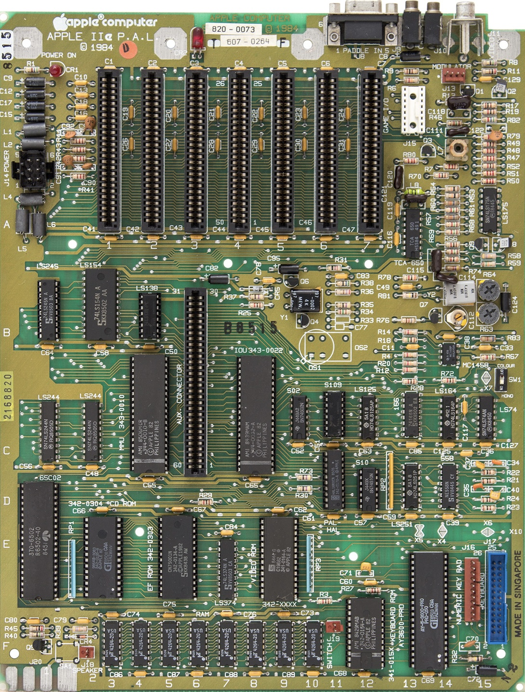

# pct-connectors-rebuild
In this repository I consolidate all the elements which allow to use an "AE PC Transporter" card in an Apple IIe or IIgs. In particular, this repository contains elements allowing to recreate the cables and connectors which are generally lost when one of these cards is found.  
The data comes from different sources available on Internet. I will try to reference them all in the "useful links" section.  

  

figure 1: PC Transporter rev D (front view)

## Connector locations  
### PCT Card

figure 2: front view card diagram with connector locations

<pre>
J1 - Apple II Speaker motherboard connector (INPUT)
J2 - Composite video (OUTPUT)
J3 - IIe keyboard adapter (INPUT)
J4 - PC Transporter Disk drive (INPUT/OUTPUT)
J5 - PC Compatible keyboard (XT/AT or PS/2) (INPUT)
J6 - ColorSwitch/CGA (OUTPUT)
J7 - Apple II Speaker (OUTPUT)
</pre>

### Apple IIe

  

figure 3: Apple IIe motherboard

<pre>
J13 (A14)   - Composite video (INPUT/OUPUT)
J17 (E/F15) - IIe keyboard adapter (INPUT)
J18 (F2)    - Apple II Speaker motherboard connector (OUTPUT)
</pre>

## Video Composite output
### Molex connector
<pre>
____
|2||   Video Composite (NTSC)
|1||   GND
----
(front view)
</pre>
### Apple II internal Video Connector (J13)
<pre>
===========
| 4 3 2 1 |
-----------
(Front view)

1  GND
2  Video Composite (NTSC or PAL)
3  -5V
4  +12V
</pre>

### Video Cable
<pre>
Molex  PS/2
1  -   1
2  -   2
   -   3
   -   4
</pre>

### status
done, working.

## CGA Video cable (AE Digital RGB Adapter)

This cable is to use to output video signal directly to a CGA compatible monitor (TTL monitor). Apple II and PCT card can't share easily the same connection for this kind of video connection.

One side is a DB9 Male connector.
Other one a "10 pins male IDC connector".

Ribbon cable mount connectors are the best way to make this cable. Some parts that could be used :

- IDC : https://fr.farnell.com/en-FR/wurth-elektronik/61201025821/plug-idc-2-54mm-strain-relief/dp/2356318
- DB9 : https://fr.farnell.com/en-FR/multicomp-pro/8ftm09p-30n1-fec/plug-idc-d-threaded-9way/dp/1099306

### 10 pin IDC Male  

<pre>
(front view)  
____________________   
| 2   4   6   8  10|  
| 1   3   5   7   9|  
--------|   |-------  
  |1             |  
  |ribbon  cables|  
  
1 GND
2 Intensity
3 (NC for CGA)
4 (NC for CGA)
5 Red
6 HS
7 Green
8 VS
9 Bleu
10 -
</pre>

### DB9 Female

(note the cutout in the ribbon cable)  

<pre>
 | ribbon  |
 | cables  |
_|_______ 1|_
\ 5 4 3 2 1 /
 \ 9 8 7 6 /
  ---------
(front view)

Pin  CGA Function
1    GND
2    GND
3    Red
4    Green
5    Blue
6    Intensity
7    Reserved
8    Horizontal Sync
9    Vertical Sync
</pre>

### Cable
<pre>
IDC    DB9  
1  --  1  
2  --  6  
3      2  
4      7  
5  --  3  
6  --  8  
7  --  4  
8  --  9  
9  --  5  
10  
</pre>
Do not connect 3 and 4 IDC pins. Cut strands 3 and 4 of the ribbon cable (see photo).  
### usage
The cable connects to J6. There is no key on the male connector, the cable "points" to the right (female connector notch on the right if you look at the board as it is shown in Figure 1). 
### Bonus
You can have cristal clear output on HDMI monitor by using RGBtoHDMI (https://github.com/hoglet67/RGBtoHDMI). The profile to use is : [to add]  

### status
done, working.

## Storage connector  

### 20 pin IDC Female  
<pre>
_________________________________________   
| 20  18  16  14  12  10  8   6   4   2 |  
| 19  17  15  13  11   9  7   5   3   1 |  
------------------|   |------------------  
  |                                  1|  
  |           ribbon cables           | 
(front view)  
</pre>
### DB19 Female
<pre>
  |                              |
 _|_____________________________1|_
 \  10  9  8  7  6  5  4  3  2  1 /
  \  19 18 17 16 15 14 13 12 11  / 
   ------------------------------  
(front view)

Pin Function apple pinout
1   GND      GND
2   GND      GND
3            GND
4            GND (IIgs: /3.5DISK bidirectional)
5            -12V
6   5V       +5V
7   12V      +12V
8   12V      +12V
9            /ENABLE2 (IIc /EXTINT)
10           WPROD (Macintosh: PWM)
11           PHASE0
12           PHASE1
13           PHASE2 
14           PHASE3
15           /WREQ
16           (Machintosh: SELECT, IIe/II+: +5V, IIc: N.C., IIgs: SELECT bidirectional)
17           /ENABLE (II+/IIe/IIgs: /ENABLE1)
18           RD
19           WR
</pre>

### Cable
<pre>
IDC    DB9  
1  --  1  
2  -- 11  
3      2  
4     12  
5  --  3  
6  -- 13  
7  --  4  
8  -- 14  
9  --  5  
10 -- 15
11 --  6
12 -- 16
13 --  7
14 -- 17
15 --  8
16 -- 18
17 --  9
18 -- 19
19 -- 10
20
</pre>
### usage
[todo]

### status
done, working.

## Apple 2e keyboard adapter

### connections

[schema]

### PCB

[comming soon]

### status
done, working.

## PC Compatible keyboard

This cable is based on a "PS2 extension cable for keyboard and mouse" (like https://amzn.eu/d/a3pizTv) cut approximately 50 cm after the female connector. An 5 pins JST connector (molex connector alternative) is connected to the cables. The female connector is glued into a 3D printed mounting enclosure that can be attached to one of the db25 cutouts on the back of the Apple IIe (the stl will be available in the repository soon).

### Molex connector
<pre>
____
|5||   +5V
|4||   GND
|3||
|2||   Data
|1||   Clock
----
(cable connector - frond view)
</pre>
### PS/2 Connector
<pre>
    6  N  5
   4       3
     2   1
(socket/female - front view)
</pre>
### PS/2 Cable
<pre>
Molex  PS/2
 1  -  5
 2  -  1
(3  -  2) - 2 unused pins, connection not needed
 4  -  3
 5  -  4
       6
</pre>
### status
done, test in progress.

## useful links
PCT documentations and software  
https://ae.applearchives.com/all_apple_iis/pc_transporter/  

Various PCT Pinouts and adaptaters  
https://www.applefritter.com/appleii-box/harrowalsh.de/APPLEBOX/APPLE2/Manuals/AE%20PC%20Transporter%20ComponentsPinouts.pdf  

Pinouts, adapters and other resources  
https://osites.tripod.com/transport.html  

Schematics and PCB for 5.25" and 3.5" PC floppy drive adapter rebuild  
https://www.applefritter.com/appleii-box/H070_AppleIITransDriveAdaptor.htm  

Pinouts of various Apple II, Apple IIe, Apple IIc, Apple IIgs and Apple Printers connectors  
https://mirrors.apple2.org.za/ftp.apple.asimov.net/documentation/hardware/misc/Apple%20II%20Family%20Pinouts.pdf  

For photos  
https://www.applefritter.com/content/applied-engineering-pc-transporter-and-drives  
