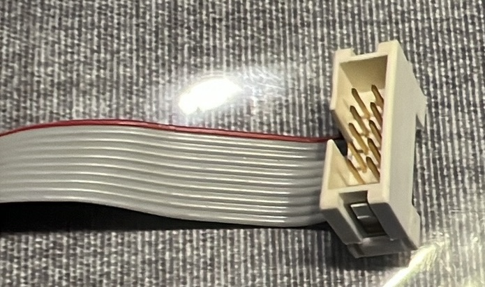
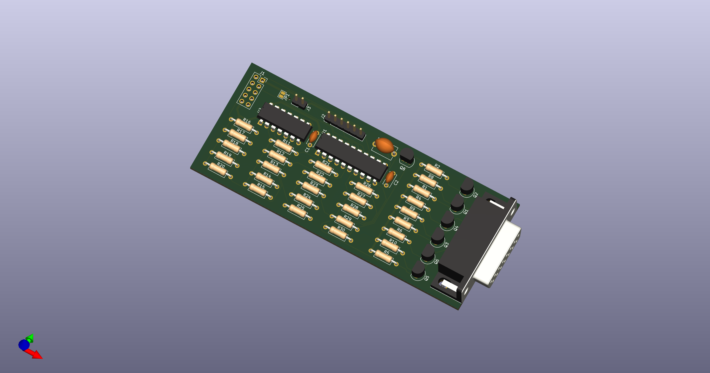

# pct-connectors-rebuild
This repository consolidate all the elements which allow to use an "AE PC Transporter" card in an Apple IIe or IIgs. In particular, It contains elements allowing to recreate the cables and connectors which are generally lost when one of these cards is found.  
Most of the data used to produce the resources of this repository comes from various sources available on the Internet and are referenced in the “useful links” section.  

  

figure 1: PC Transporter rev D (front view)

## Connector locations  
### PCT Card

figure 2: front view card diagram with connector locations

<pre>
J1 - Apple II Speaker motherboard connector (INPUT)
J2 - Composite video (OUTPUT)
J3 - IIe keyboard adapter (INPUT)
J4 - PC Transporter Disk drive (INPUT/OUTPUT)
J5 - PC Compatible keyboard (XT protocol) (INPUT)
J6 - ColorSwitch/CGA (OUTPUT)
J7 - Apple II Speaker (OUTPUT)
</pre>

### Apple IIe

  

figure 3: Apple IIe PAL motherboard

  

figure 4: Apple IIe (platinum) US motherboard

<pre>
J13 (A14)                  - Composite video (INPUT/OUPUT)
J17 (PAL:E/F15, US:B14)    - IIe keyboard adapter (INPUT)
PAL:J18 (F2), US:J10 (F14) - Apple II Speaker motherboard connector (OUTPUT)
</pre>
Note the different spacing between the keyboard connector (J17) and the numeric keypad connector (J16) of the two card versions.

## Video Composite output
Simple two wires cable. Cheap female/female jumper wire can be used.
PCT Card outputs an NTSC composite video signal on J2. PAL motherboards can nevertheless be wired to this Molex connector, but the monitor must be able to switch NTSC and PAL signals.
### Molex connector
<pre>
____
|2||   Video Composite (NTSC)
|1||   GND
----
(front view)
</pre>
### Apple II internal Video Connector (J13)
<pre>
===========
| 4 3 2 1 |
-----------
(Front view)

1  GND
2  Video Composite (NTSC or PAL)
3  -5V
4  +12V
</pre>

### Video Cable
<pre>
Molex  Apple II connector
1  -   1
2  -   2
   -   3
   -   4
</pre>

### status
done, working.

## CGA Video cable (AE Digital RGB Adapter)

This cable is to use to output video signal directly to a CGA compatible monitor (TTL monitor). Apple II and PCT card can't share easily the same connection for this kind of video connection. Same monitor can display Apple II and PCT signal but for now through two different cables and adaptors (some monitor can automatically switch inputs and "emulate" composite switch or colorswitch behavior)

One side is a DB9 Male connector.
Other one a "10 pins male IDC connector".

Ribbon cable mount connectors are the best way to make this cable. Some parts that could be used :

- IDC : https://fr.farnell.com/en-FR/wurth-elektronik/61201025821/plug-idc-2-54mm-strain-relief/dp/2356318
- DB9 : https://fr.farnell.com/en-FR/multicomp-pro/8ftm09p-30n1-fec/plug-idc-d-threaded-9way/dp/1099306

### 10 pin IDC Male  

<pre>
(front view)  
____________________   
| 2   4   6   8  10|  
| 1   3   5   7   9|  
--------|   |-------  
  |1             |  
  |ribbon  cables|  
  
1 GND
2 Intensity
3 NC for CGA - Source selection for Colorswitch (PCT output signal on CGA/Composite)
4 NC for CGA - CSync for Colorswitch
5 Red
6 HS for CGA - NC for Colorswitch
7 Green
8 VS for CGA - NC for Colorswitch
9 Bleu
10 -
</pre>

### DB9 Female

(note the cutout in the ribbon cable)  
  
<pre>
 | ribbon  |
 | cables  |
_|_______ 1|_
\ 5 4 3 2 1 /
 \ 9 8 7 6 /
  ---------
(front view)

Pin  CGA Function
1    GND
2    GND
3    Red
4    Green
5    Blue
6    Intensity
7    Reserved
8    Horizontal Sync
9    Vertical Sync
</pre>

### Cable
<pre>
IDC      DB9  
  1  --  1  
  2  --  6  
  3      2  
  4      7  
  5  --  3  
  6  --  8  
  7  --  4  
  8  --  9  
  9  --  5  
  10  
</pre>
Do not connect 3 and 4 IDC pins. Cut strands 3 and 4 of the ribbon cable (see photo).  
### usage
The cable connects to J6. There is no key on the male connector, the cable "points" to the right (female connector notch on the right if you look at the board as it is shown in Figure 1). 
### Bonus
You can have cristal clear output on HDMI monitor by using RGBtoHDMI (https://github.com/hoglet67/RGBtoHDMI). The profile to use is : [Commodore/Commodore 128 CGA Brown]  

### status
done, working.

## Colorswitch
The ColorSwitch was designed to allow a PCT-equipped Apple IIGS to display CGA on a standard A2M6014 monitor or a compatible RGB monitor (ex: Sony RGB Monitor, cf AE catalog). When the PCT software is launched, the display automatically switches Apple screen to CGA screen.
This card can also be used with an Apple 2e using an RGB color card (for EU users, Chat Mauve card is a must for that)  

### PCB
A not tested design is available in "hardware" folder.  
This design differs from the original device. The implementation density of components is reduced (easier to solder) and the faulty and unused/useless* composite video signal circuit has been removed.  
(*) would have been useful with a specific monitor able to display RGB and composite. Could be add in a futur version.   

#### ColorSwitch DB15 female connector
<pre>
1 : RED GND
2 : RED(*)
3 : CSYNC (negative, 2000 Ohms, 4V +/- 1V)
4 : -
5 : GREEN(*)
6 : GREEN GND
7 : -
8 : -
9 : BLUE(*)
10 : -
11 : -
12 : -
13 : BLUE GND
14 : -
15 : -
(*) : 75 Ohms, 1V +/- 0.5V peek-to-peek
</pre>
### ColorSwitch IDC6 connector
<pre>
1 : CSYNC
2 : (composite)
3 : GREEN
4 : RED
5 : BLUE
6 : GND
</pre>
### PCT to Colorswitch cable
flat cable with 2 idc10 male connector.  
<pre>
IDC10  IDC10  
   1 -- 1
   2 -- 2
   3 -- 3
   4 -- 4
   5 -- 5
   6 -- 6
   7 -- 7
   8 -- 8
   9 -- 9
  10 -- 10
</pre>

(photo)   

### db15 to Colorswitch cable (for Apple IIGS)
### Chat Mauve to Colorswitch cable
Several connection are possible. You can use internal (on card) or external connector (throug db connectors).
#### Chat Mauve on card IDC8 connector
<pre>
  =================  
  |1 2 3 4 5 6 7 8|  
  -----------------  
1 - RGB/Composite commutation
2 - Audio out
3 - CSYNC (75 Ohms, 0.5V)
4 - RED (75 Ohms, 0 to 0.7V)
5 - GREEN (75 Ohms, 0 to 0.7V)
6 - BLUE (75 Ohms, 0 to 0.7V)
7 - GND
8 - 12V
</pre>
#### Chat Mauve DB9 female connector
<pre>
_____________  
\ 5 4 3 2 1 /  
 \ 9 8 7 6 /  
  ---------  
1 : NC  
2 : GND  
3 : GREEN (75 Ohms, 0 to 0.7V)  
4 : CSYNC (negative, 75 Ohms, 0.5V)  
5 : RGB/Composite commutation  
6 : 12V
7 : BLUE (75 Ohms, 0 to 0.7V)  
8 : RED (75 Ohms, 0 to 0.7V)  
9 : Audio out
</pre>
#### BONUS 1 : Chat Mauve to A2M6014 compatible
<pre>
DB9    DB15      IDC8    DB15
  1 --              1 --
  2 -- 1,6,13       2 -- 
  3 -- 5            3 -- 3
  4 -- 3            4 -- 2
  5 --              5 -- 5
  6 --              6 -- 9
  7 -- 9            7 -- 1,6,13
  8 -- 2            8 --
  9
</pre>
### BONUS 2 : Colorswitch to scart cable

### Status
work in progress  

## Storage connector  

### 20 pin IDC Female  
<pre>
_________________________________________   
| 20  18  16  14  12  10  8   6   4   2 |  
| 19  17  15  13  11   9  7   5   3   1 |  
------------------|   |------------------  
  |                                  1|  
  |           ribbon cables           | 
(front view)  
</pre>
### DB19 Female
<pre>
  |                              |
 _|_____________________________1|_
 \  10  9  8  7  6  5  4  3  2  1 /
  \  19 18 17 16 15 14 13 12 11  / 
   ------------------------------  
(front view)

Pin Function apple pinout
1   GND      GND
2   GND      GND
3            GND
4            GND (IIgs: /3.5DISK bidirectional)
5            -12V
6   5V       +5V
7   12V      +12V
8   12V      +12V
9            /ENABLE2 (IIc /EXTINT)
10           WPROD (Macintosh: PWM)
11           PHASE0
12           PHASE1
13           PHASE2 
14           PHASE3
15           /WREQ
16           (Machintosh: SELECT, IIe/II+: +5V, IIc: N.C., IIgs: SELECT bidirectional)
17           /ENABLE (II+/IIe/IIgs: /ENABLE1)
18           RD
19           WR
</pre>

### Cable
<pre>
IDC    DB9  
1  --  1  
2  -- 11  
3      2  
4     12  
5  --  3  
6  -- 13  
7  --  4  
8  -- 14  
9  --  5  
10 -- 15
11 --  6
12 -- 16
13 --  7
14 -- 17
15 --  8
16 -- 18
17 --  9
18 -- 19
19 -- 10
20
</pre>
### usage
The IDC connector is keyed (the cable is oriented towards the inside of the apple II). Connect 800ko 3.5" Apple floppy drive (/!\ do not connect 3.5" unidisk) or AE Transdrive to DB19 connector. Drive can be daisy chained check documentation.

### status
done, working.

## Apple 2e keyboard adapter

The keyboard adapter is a small PCB and a ribbon cable supplied as an option with the PCT card. This adapter is placed between the Apple motherboard and the keyboard and provides status of "dead keyboard keys" (control, shift, Apple open/close and capslock) to the PCT card. The other signals are only pass-throughs from the keyboard to the motherboard of the Apple 2e.

### connections
Connections are described in this [schema](hardware/a2keyboardToPCT/a2keyboardToPCT.pdf)

### PCB
Based on the connections schema, it can be found in this repository:
[KiCad project and gerber files](hardware/a2keyboardToPCT/V0.0)  
The original version of the connector was designed for a US motherboard. It can be installed on a PAL computer but the connector for the numeric keypad may conflict with the keyboard adapter.  
This PCB is roughly the same size and layout as the original one and therefore may have the same issue. It is best to use elevated female IDC connector if used with PAL Apple IIe (for example https://fr.farnell.com/en-FR/samtec/esq-113-44-t-d/connect-femelle-26-voies-2-rangs/dp/2779437).
### status
done, working.

## PC Compatible keyboard

This cable is based on a "PS2 extension cable for keyboard and mouse" (like https://amzn.eu/d/a3pizTv) cut approximately 50 cm after the female connector. An 5 pins JST connector (molex connector alternative) is connected to the cables. The female connector is glued into a 3D printed mounting enclosure that can be attached to one of the db9 or db25 (2 versions available) cutouts on the back of the Apple IIe. This first version of the connector need an AT (PS/2) keyboard able to use the XT protocol. Not all AT keyboards are capable to use this protocol, rare older AT keyboards have automatic or manual switching capabilities from AT to XT protocol.  

/!\ An active protocol translator for using a ps/2 keyboard as an XT keyboard can be found here: https://github.com/asig/ps2-to-xt-adapter/tree/master. Work is done to integrate it on a small PCB directly pluggable onto the PCT card.

### Molex connector
<pre>
____
|5||   +5V
|4||   GND
|3||
|2||   Data
|1||   Clock
----
(cable connector - frond view)
</pre>

### PS/2 Connector
<pre>
    6  N  5
   4       3
     2   1
(socket/female - front view)

Pin   Function
 1    Data
 2    NC
 3    GND
 4    +5V
 5    Clock
 6    NC
</pre>
### PS/2 Cable
<pre>
Molex  PS/2
 1  -  5
 2  -  1
(3  -  2) - 2 unused pins, connection not needed
 4  -  3
 5  -  4
       6
</pre>
### status
Cable: done, working  
XT/AT converter: done, working  

## Sound Connector
One or two Simple two wires (dupont) cable. Cheap female/female jumper wire can be used to connect motherboard J18 to PCT J1. If the speaker cable is long enough it can be connected directly to the J7 connector of the PCT card. If not, a cheap female/male jumper wire can be used.

### PCT Molex connector (J1 / J7)
<pre>
____
|2||   Sound signal
|1||   +5V
----
(front view)
</pre>

### Apple II speaker
<pre>
____
|2||   Sound signal
|1||   +5V
----
(front view)
</pre>

## GOTEK + flashfloppy as secondary drive in single TransDrive
3D printed enclosure, configuration and cables.  
https://github.com/keirf/flashfloppy  
(coming soon)

## useful links
PCT documentations and software  
https://ae.applearchives.com/all_apple_iis/pc_transporter/  

French PCT documentation  
http://www.apple-iigs.info/doc/fichiers/Brejoux_PC_Transporter%202.pdf  

Various PCT Pinouts and adaptaters (but not exhaustive)  
https://www.applefritter.com/appleii-box/harrowalsh.de/APPLEBOX/APPLE2/Manuals/AE%20PC%20Transporter%20ComponentsPinouts.pdf  

Pinouts, adapters and other resources  
https://osites.tripod.com/transport.html  

Schematics and PCB for 5.25" and 3.5" PC floppy drive adapter rebuild  
https://www.applefritter.com/appleii-box/H070_AppleIITransDriveAdaptor.htm  

Pinouts of various Apple II, Apple IIe, Apple IIc, Apple IIgs and Apple Printers connectors  
https://mirrors.apple2.org.za/ftp.apple.asimov.net/documentation/hardware/misc/Apple%20II%20Family%20Pinouts.pdf  

RGB TTL to RGB Analogic  
https://downloads.reactivemicro.com/Apple%20II%20Items/Hardware/Apple_II_AppleColor_TTI_RGB/TheMarcorlandiModification_TTLRGB.pdf  

For photos  
https://www.applefritter.com/content/applied-engineering-pc-transporter-and-drives  
